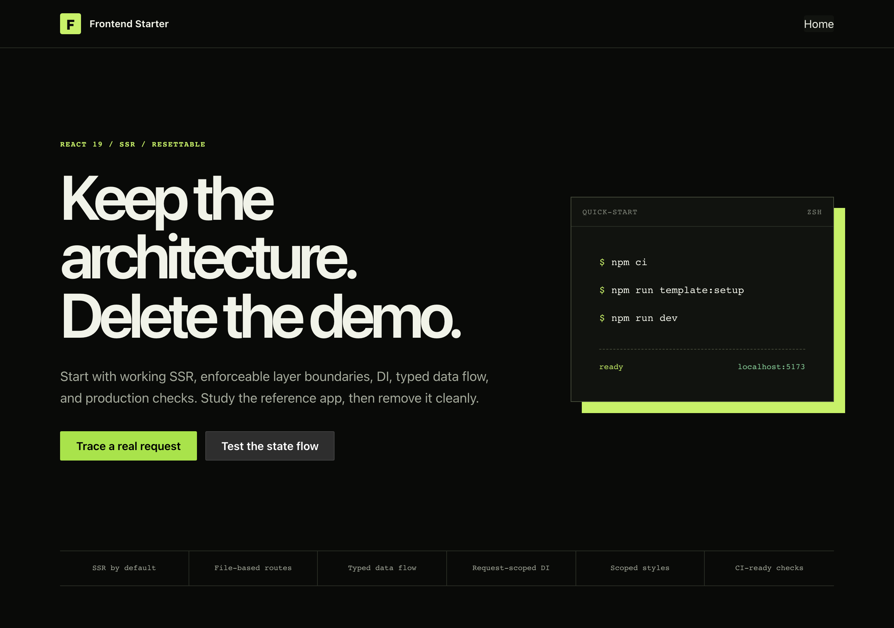

<div align="center">


<br />

<a href="https://github.com/AntonBelousovWEB/JST/actions/workflows/ci.yml"></a>
<a href="https://www.typescriptlang.org/"></a>
<a href="https://react.dev/"></a>
<a href="https://nodejs.org/"></a>
<a href="https://github.com/AntonBelousovWEB/JST/pulls"></a>

</div>

# Frontend Starter

A React starter with server rendering, enforced architectural boundaries, and a working delivery pipeline: React Router Framework Mode for SSR, Reatom for view models, dependency injection for effectful boundaries, and a shared HTTP client that keeps transport out of the domain layer.

A reference app — a live JSONPlaceholder request and a local-persistence workflow — exercises every layer described below. Remove it when you're ready to build; the architecture stays.

<div align="center">

</div>

## Table of contents

- [Quick start](#quick-start)
- [Technology stack](#technology-stack)
- [Project structure](#project-structure)
- [Architecture](#architecture)
- [Routing and SSR](#routing-and-ssr)
- [State, styling, icons](#state-styling-icons)
- [AI architecture guidance](#ai-architecture-guidance)
- [Commands](#commands)
- [Quality gates](#quality-gates)
- [Production](#production)
- [Deliberate omissions](#deliberate-omissions)
- [Contributing, security, license](#contributing-security-license)

## Quick start

Requirements: **Node.js 24**, **npm 11**.

```bash
npm ci
npm run dev
```

Dev server: `http://localhost:5173` (SSR, HMR, route type generation).

Configure the template interactively:

```bash
npm run template:setup
```

Sets package/display name, SEO description, document language, Mantine color scheme and primary color, and whether to keep the reference app. Non-interactive equivalent:

```bash
npm run template:setup -- --yes --name my-product --title "My Product" \
  --description "My product description." --lang en \
  --color-scheme auto --primary-color violet --demo remove
```

Full CLI reference: `npm run template:setup -- --help`.

## Technology stack

| Layer | Technologies |
| --- | --- |
| Runtime & UI | [React 19](https://react.dev/), [TypeScript 5.9](https://www.typescriptlang.org/), [Mantine 9](https://mantine.dev/) |
| Framework & build | [React Router 8](https://reactrouter.com/) (Framework Mode, SSR), [Vite 8](https://vite.dev/) |
| State | [Reatom](https://reatom.dev/) |
| DI | [Needle DI](https://github.com/needle-di/needle-di) |
| HTTP | Native Fetch behind a shared, repository-scoped client |
| Testing | [Vitest](https://vitest.dev/), [Playwright](https://playwright.dev/), [Axe](https://www.deque.com/axe/) |
| Quality | [ESLint](https://eslint.org/) (type-aware) + [`@boundaries/eslint-plugin`](https://github.com/boundaries-io/eslint-plugin), [Stylelint](https://stylelint.io/), [Knip](https://knip.dev/), lint-staged, Husky |
| Icons | [vite-plugin-svg-icons-ng](https://github.com/6thpath/vite-plugin-svg-icons-ng) (build-time sprite) |
| CI | GitHub Actions, Dependabot (weekly) |

## Project structure

```text
src/
├── app/          application providers, DI composition, root layout
├── pages/        React Router route modules and page composition
├── widgets/      reusable page-level UI blocks
├── features/     user-facing use cases
├── entities/     domain models, services, repositories, stores, entity UI
└── shared/       framework-independent infrastructure and utilities
```

Dependency direction is one-way and lint-enforced (aliases and relative imports both checked):

- `shared` cannot import `app`/`pages`/`entities`/`features`/`widgets`.
- `entities` can depend only on `entities` and `shared`.
- `features` cannot depend on `app`, `pages`, or `widgets`.
- `widgets` cannot depend on `app` or `pages`.

Types live next to the code they describe; a standalone `types.ts` is created only when it earns its place, not by convention.

## Architecture

Each use case is modeled before it's implemented, in this order: domain types and invariants → consumer-owned ports (the minimum I/O a use case needs) → adapters implementing those ports (HTTP, storage) → a service as the use-case facade → a Reatom store as view model → an entry that maps the store to a props-driven view. Static pages and trivial controls skip the layers they don't need.

**Presentation (MVC/MVVM):** the Reatom store is the view model (derived async state + user actions); the entry is the controller mapping store to props; the view is a pure function of props with no knowledge of stores or services.

```tsx
export const PostsFeedEntry = reatomComponent(() => {
	const { postsStore } = usePostsFeedService()
	return (
		<PostsFeedView
			error={postsStore.posts.error()}
			pending={postsStore.posts.pending() > 0}
			posts={postsStore.posts.data()}
			ready={postsStore.posts.ready()}
			onRefresh={wrap(() => postsStore.refresh())}
		/>
	)
}, 'PostsFeedEntry')
```

**SOLID, mapped to real classes:**

| Principle | Where |
| --- | --- |
| Single responsibility | `HttpClient` → `PostsApi` → `PostsService` → `PostsStore`, each with one reason to change |
| Open/closed | `PostsRepository` port + `PostsApi` adapter — swap backends by rebinding the token |
| Liskov substitution | `PostsApi implements PostsRepository`, `LocalStoragePersister implements KeyValueStorage` |
| Interface segregation | `PostsRepository` (one method), `KeyValueStorage` (four methods), `PostsFeedDeps` (`{ postsStore }`) |
| Dependency inversion | `PostsService` depends on `POSTS_REPOSITORY_TOKEN`, never on `PostsApi` directly |

**Dependency injection / IoC / service locator — three distinct things:**

- *DI*: dependencies arrive via constructor (`inject(POSTS_REPOSITORY_TOKEN)`), not import-time singletons.
- *IoC*: [`createAppContainer()`](src/app/container/container.ts) auto-discovers every `*.provider.ts` via `import.meta.glob` and binds adapters to ports.
- *Service locator* (`useService`): scoped strictly to `app`/`pages` composition. Lower layers never call it directly — they get dependencies through constructors or narrow feature injectors (`PostsFeedDeps`).

Inject effectful or replaceable boundaries only (HTTP, storage, clocks, analytics) — never plain data or a single-implementation interface.

**Design patterns:** Builder ([`PostsBuilder`](src/entities/post/model/posts.builder.ts), [`TemplateItemsBuilder`](src/entities/templateModule/model/templateItems.builder.ts)) for staged model construction; Observer (Reatom `computed`/`action` + `reatomComponent`) for view-model → view updates; Facade ([`PostsService.getFeaturedPosts()`](src/entities/post/services/posts.service.ts)) for multi-step use cases; Gateway ([`PostsApi`](src/entities/post/repository/posts.api.ts), [`LocalStoragePersister`](src/shared/storages/LocalStoragePersister.ts)) for external effects. Object relationships are composition/aggregation, not inheritance; inheritance appears only via `implements`.

**Bounded contexts:** `entities/post` (live API) and `entities/templateModule` (local persistence) share nothing but `shared` infrastructure. DTOs (`src/shared/dto`) never reach UI — each service maps DTOs into its own domain model.

`npm run lint:architecture` verifies the DI kernel and that feature UI never imports orchestration internals; ESLint separately enforces layer direction.

## Routing and SSR

[`src/routes.ts`](src/routes.ts) discovers route modules under `src/pages` by file convention — no manual route registry:

```text
src/pages/
├── _index/route.tsx                 /
├── about/route.tsx                  /about
└── products.$productId/route.tsx    /products/:productId
```

Add `navigation.ts` beside a route to include it in primary navigation — these metadata modules are discovered at build time without eagerly importing route code.

React Router owns the dev server, builds, HTTP responses, hydration, and route errors; [`src/root.tsx`](src/root.tsx) owns only the document shell and providers. React 19 hoists `<title>`/`<meta>`/`<link>` into the head during SSR. The root route sends safe, origin-independent headers only — CSP, HSTS, and other deployment-specific policies belong in your hosting config.

## State, styling, icons

- **State:** Reatom stores live in the owning entity; feature entries subscribe via `reatomComponent`. Leaf UI never resolves stores, services, or the container directly.
- **Styling:** colocated CSS Modules matching their owner's basename (`PostCard.tsx` / `PostCard.module.css`). `src/index.css` holds only tokens, resets, and accessibility defaults. `npm run lint:styles` enforces naming, colocation, and camelCase locals.
- **Icons:** put SVGs in `src/shared/assets/icons`; the build compiles them into a sprite present in server HTML. Render via [`SvgIcon`](src/shared/ui/SvgIcon.tsx) — decorative by default, pass `aria-label` for meaningful icons.

## AI architecture guidance

[`skills/frontend-architecture/SKILL.md`](skills/frontend-architecture/SKILL.md) is the compact reference for coding agents: layer ownership, the DTO → repository → service → view-model flow, and when DI is warranted. [`AGENTS.md`](AGENTS.md) points agents to it automatically.

## Commands

| Command | Purpose |
| --- | --- |
| `npm run dev` | Start the SSR dev server |
| `npm run typecheck` | Generate route types and run TypeScript |
| `npm run build` | Type-check and build client/server bundles |
| `npm start` | Serve the production build |
| `npm test` | Vitest in watch mode |
| `npm run test:unit` | Run unit/integration tests once |
| `npm run test:e2e` | Build and run Playwright SSR/hydration tests |
| `npm run lint` | Cached, type-aware ESLint, zero warnings |
| `npm run lint:architecture` | Verify DI kernel and feature UI isolation |
| `npm run lint:fix` | Apply safe ESLint fixes |
| `npm run lint:styles` | Stylelint + CSS Module contract |
| `npm run knip` | Find unused files, exports, dependencies |
| `npm run check` | Run the full local CI gate |
| `npm run template:setup` | Configure the product |

## Quality gates

- **Vitest** — colocated app tests plus `scripts/**/__tests__`.
- **Playwright** — SSR HTML with JS disabled, stable initial color scheme, route errors, clean hydration, live API success/error paths, keyboard navigation, Axe accessibility checks.
- **Knip** — dead files, exports, dependencies.
- **Stylelint** — CSS quality and colocation contract.
- **Husky + lint-staged** on commit; full gate in **GitHub Actions** (lint, unit tests, typecheck, build, Chromium E2E). **Dependabot** runs weekly.

Before opening a PR:

```bash
npm run check
npm run test:e2e
```

E2E specs are grouped by product area, not dumped in one folder:

```text
e2e/
├── smoke/                 SSR, errors, hydration, accessibility
├── checkout/              checkout journeys
└── account-settings/      account journeys
```

Use `*.spec.ts` with role/label-based Playwright locators; extract a fixture or page object only once a workflow is genuinely shared.

## Production

```bash
npm run build
PORT=3000 npm start
```

Deploy `build/`, `package.json`, `package-lock.json`, and production dependencies to any Node.js host. Add a platform-specific React Router adapter only if your target requires one.

## Deliberate omissions

No auth framework, mock server, analytics SDK, runtime schema library, or environment schema is included — add these once the product has a real contract for them.

- A service worker needs an explicit offline/update/cache policy; a generic cache can serve stale SSR or authenticated responses.
- Partytown only helps once real third-party scripts measurably block the main thread.
- Unhead would duplicate React 19 / React Router's own metadata handling.
- Helmet is Express middleware; this template has no custom Express server.

## Contributing, security, license

- Contribution workflow: [`CONTRIBUTING.md`](CONTRIBUTING.md)
- Report vulnerabilities per [`SECURITY.md`](SECURITY.md) — never in a public issue.

---

<div align="center">
  <sub>React 19, React Router, TypeScript, Reatom, Mantine. Keep the architecture, delete the demo.</sub>
</div>